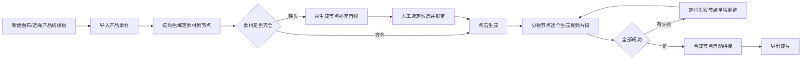
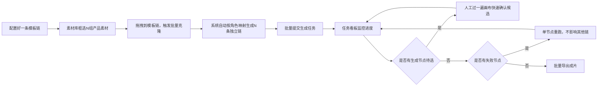
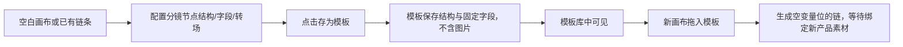

# 02_页面结构与用户流程

## 1. 信息架构

```
工作台首页（画布列表）
├─ 画布编辑页（核心页面）
│   ├─ 无限画布主区
│   ├─ 左侧素材库面板
│   ├─ 右侧模板库面板 / 节点编辑抽屉（互斥展示）
│   └─ 顶部工具栏（总时长、生成、导出、存为模板）
├─ 模板库管理页（模板的增删改查、跨画布复用）
├─ 素材需求清单配置页（按产品线维护清单，先于拍摄/制作）
├─ 批量任务看板页（生成进度监控、失败重跑）
└─ 成片导出管理页（历史导出记录、下载）
```

MVP 阶段素材需求清单配置、批量任务看板可先以**画布内嵌面板**形式存在，不单独开独立路由页，降低开发成本；V1 阶段再拆分为独立页面以支持跨画布的全局视角。

## 2. 页面说明

### 2.1 工作台首页
- 展示已创建的画布（按产品线/时间排序）
- 入口：新建画布（选择产品线 → 选择起始模板或空白画布）

### 2.2 画布编辑页（核心）
- 主区：无限画布，承载素材节点/AI生成节点/分镜节点/合成节点及连线
- 左侧栏：素材库（分组展示、角色标签、上传入口）
- 右侧栏：默认展示"模板库"，点击节点后切换为"节点编辑抽屉"
- 顶部栏：当前链总时长实时显示、生成按钮、存为模板按钮、导出按钮

### 2.3 批量任务看板
- 展示当前批次所有产品链的生成状态（排队/生成中/部分完成/完成/失败）
- 支持点击失败项跳转回画布定位到具体节点

### 2.4 成片导出管理
- 按产品/批次列出已导出成片，支持按平台规格重新导出、下载

## 3. 核心用户流程

### 流程一：单产品从零到出片



### 流程二：批量生产（N 个产品）



### 流程三：模板创建与复用



### 流程四：素材需求清单前置配置

```mermaid
flowchart LR
A[产品线选定] --> B[配置该产品线的素材角色清单]
B --> C[清单锁定为模板配置]
C --> D[拍摄/制作团队按清单交付]
D --> E[素材上传后按角色自动/手动匹配]
E --> F[画布节点从"待补充"变为"已绑定"]
```

## 4. 关键交互节点说明

- 流程一中的"人工选定候选并锁定"是**唯一必须的人工确认点**，锁定后不再重复触发
- 流程二的批量克隆是本平台区别于普通视频剪辑工具的核心能力，需保证克隆操作可撤销、可预览范围（详见 06）
